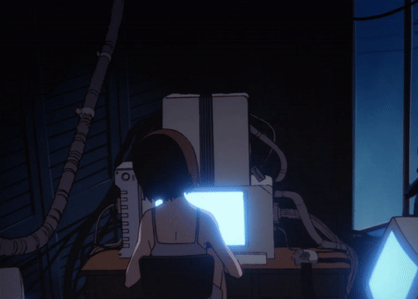

Что вершит судьбу человечества в этом мире? 
Некое незримое существо или закон, подобно Длани Господней парящей над миром?
По крайней мере истинно то, что человек не властен даже над своей волей.

- 🤓 I’m currently learning HTML, CSS, Python, and JS.
- 🔭 Want to be system architect in the future.
- ♻︎ Love gtbsg, neovim, retro-futuristic anime.

